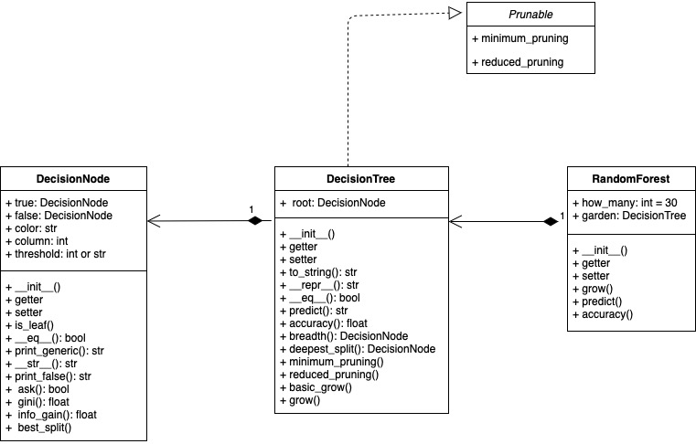

# dbalg21
Final project of Algoritmhs course a.y. 2020-2021 at Stochastic and Data Science (UniTo).  
The goal is to solve a real problem with a family of algorithms studied in class (or a new one).

## The problem
The aim is to predict the result of ATP tennis matches using random forest (CART algorithm).
The raw dataset can be found at http://tennis-data.co.uk/alldata.php and it is also present in the data folder (atp_data.csv).
The classifier has then been implemented on a suitable transformation (tennis_data.csv).
The other datasets are for testing purposes. 

## Requirements
Use the package manager pip to install all the required packages.

```pip install -r requirements.txt```

## Usage
To train a new classifier run main.py and specify the parameters of the Forest classifier.
One can already find a trained model on 3000 matches (M3L5D12.obj)
with parameters m=3 (variables shuffling in the split), min_leaves=5 (minimum number of observations in a leaf), depth=12 (maximum depth of the trees) and pruning="mep" (minimum error pruning).
The estimated accuracy on a test set is 71%. 

## UML



